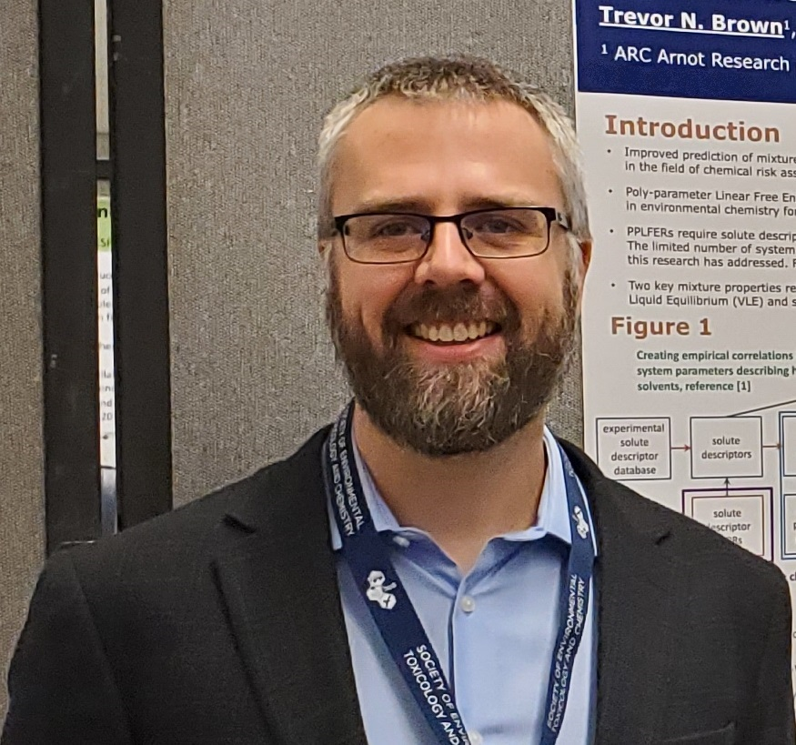

## Trevor N. Brown. Conducting scientific research in the field of Environmental Chemistry.

Dr. Trevor N. Brown is is a Reseach Associate at ARC Arnot Research & Consulting. His primary research interest is developing chemical property prediction tools for partitioning and end-points related to environmental fate. He has more than 10 years experience developing and applying Quantitative Structure Activity Relationships (QSARs). During his Ph.D., Postdoc and employment he has worked closely with analytical chemists, which gives him a unique perspective focused on the quality and reliability of the data he uses to develop QSARs. QSARs are available for use in the free online platform EAS-E Suite.

## Where to find TNB

- TNB [CV](./tnb_cv.md).
- TNB at [ARC](https://arnotresearch.com/team/trevornbrown/).
- TNB QSARs in [EAS-E Suite](http://www.eas-e-suite.com/).
- TNB on [Google Scholar](https://scholar.google.ca/citations?user=RhJqoXkAAAAJ&hl=en).
- TNB on [ResearchGate](https://www.researchgate.net/profile/Trevor_Brown).
- TNB on [GitHub](https://github.com/tnbrowncontam).

