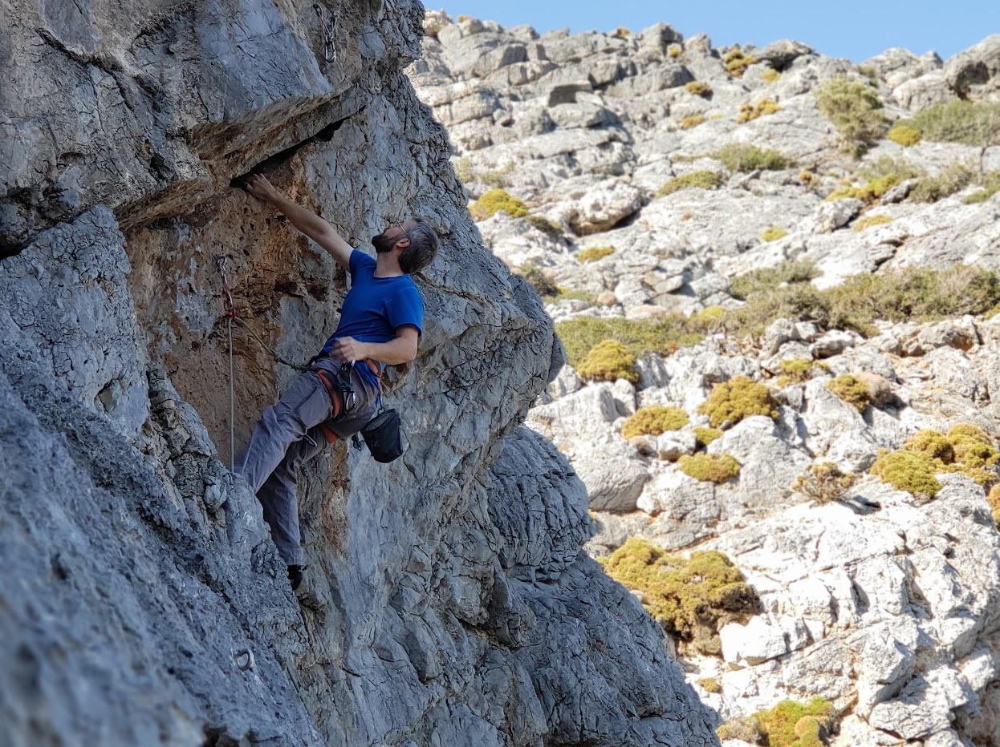

[Back to Homepage](./index.md)

## Education and Employment

Dr. Brown obtained his B.Sc. in Environmental Chemistry at Thompson Rivers University (TRU) in Kamloops, B.C., Canada. He received a cooperative education endorsement for a work term as an analytical chemist at ALS Environmental in Vancouver, and a work term as a research assistant with Nelaine Mora-Diez at TRU. He obtained his Ph.D. in Environmental Chemistry at the University of Toronto. His Ph.D. thesis, titled “Automated Methods in Chemical Risk Assessment”, was supervised by Professor Frank Wania, at the University of Toronto Scarborough campus. After his Ph.D. he was a Postdoc at the Helmholtz Centre for Environmental Research (UFZ) in Leipzig, Germany, where he did research in the Analytical Environmental Chemistry group with Professor Kai-Uwe Goss. He was then a Postdoc at Dalhousie University in Halifax, Canada, in the research group of Russell Boyd (retired). More recently he worked for three years as a Physical Scientist in the Department of Fisheries and Oceans Canada where he worked on modelling oil properties and the chemistry of oil spills within the Centre for Offshore Oil, Gas and Energy Research (COOGER) headed by Tom King. Right now Dr. Brown collaborates extensively with Jon Arnot, doing subcontracting for ARC Arnot Research and Consulting.
